# EpayNepal — ER Diagram

## Entity-Relationship Diagram

```mermaid
erDiagram
    users ||--|| wallets : has
    users ||--o{ transactions : makes
    users ||--o{ devices : registers
    users ||--o{ sessions : has
    users ||--o{ notifications : receives
    users ||--o{ otp_codes : requests
    users ||--o{ kyc_requests : submits
    users ||--o{ support_tickets : creates
    users ||--o{ beneficiaries : saves
    users ||--o{ payment_requests : "sends/receives"
    users ||--o{ audit_logs : "actions logged"

    wallets ||--o{ transactions : "debited/credited"

    transactions ||--o{ transaction_logs : "has logs"

    merchants ||--o{ merchant_qr : "has QR codes"
    merchants ||--|| users : "is a"

    support_tickets ||--o{ support_messages : contains

    admin_users ||--o{ roles : "has role"
    roles ||--o{ permissions : "has permissions"
    admin_users ||--o{ audit_logs : performs

    transactions ||--o{ recharge_history : "links to"
    transactions ||--o{ bill_payments : "links to"

    users {
        bigint id PK
        string phone UK
        string email
        string name
        string password_hash
        string pin_hash
        string profile_photo_url
        enum status "active,frozen,suspended"
        enum kyc_level "none,pending,verified"
        decimal balance_limit
        decimal transfer_limit
        timestamp email_verified_at
        timestamp phone_verified_at
        timestamps created_at
        timestamps updated_at
        timestamp deleted_at
    }

    wallets {
        bigint id PK
        bigint user_id FK
        decimal balance "decimal(15,2)"
        string currency "NPR"
        boolean is_active
        timestamps created_at
        timestamps updated_at
    }

    transactions {
        bigint id PK
        string reference_id UK
        bigint sender_wallet_id FK
        bigint receiver_wallet_id FK
        enum type "P2P,TOP_UP,WITHDRAW,QR_PAY,BILL,RECHARGE"
        decimal amount "decimal(15,2)"
        decimal fee "decimal(15,2)"
        enum status "pending,completed,failed,reversed"
        string description
        json metadata
        timestamps created_at
        timestamps updated_at
    }

    transaction_logs {
        bigint id PK
        bigint transaction_id FK
        bigint wallet_id FK
        enum action "credit,debit"
        decimal amount "decimal(15,2)"
        decimal balance_before "decimal(15,2)"
        decimal balance_after "decimal(15,2)"
        timestamps created_at
    }

    beneficiaries {
        bigint id PK
        bigint user_id FK
        string name
        string phone
        string bank_account
        enum type "user,bank"
        timestamps created_at
        timestamps updated_at
    }

    devices {
        bigint id PK
        bigint user_id FK
        string device_name
        string device_id UK
        string fcm_token
        string platform "android,ios"
        boolean is_active
        timestamp last_active_at
        timestamps created_at
        timestamps updated_at
    }

    sessions {
        bigint id PK
        bigint user_id FK
        string token_hash
        string ip_address
        string user_agent
        timestamp expires_at
        timestamps created_at
    }

    notifications {
        bigint id PK
        bigint user_id FK
        string title
        string body
        enum type "transaction,system,promo,kyc"
        json data
        boolean is_read
        timestamp read_at
        timestamps created_at
    }

    otp_codes {
        bigint id PK
        bigint user_id FK
        string phone
        string code_hash
        enum purpose "register,login,reset_password,transaction"
        integer attempts
        timestamp expires_at
        boolean is_used
        timestamps created_at
    }

    kyc_requests {
        bigint id PK
        bigint user_id FK
        string citizenship_front_url
        string citizenship_back_url
        string selfie_url
        string full_name
        string citizenship_number
        date date_of_birth
        string address_province
        string address_district
        string address_municipality
        string address_ward
        enum status "pending,approved,rejected"
        string rejection_reason
        bigint reviewed_by FK
        timestamp reviewed_at
        timestamps created_at
        timestamps updated_at
    }

    merchants {
        bigint id PK
        bigint user_id FK
        string business_name
        string business_type
        string pan_number
        string address
        boolean is_active
        timestamps created_at
        timestamps updated_at
    }

    merchant_qr {
        bigint id PK
        bigint merchant_id FK
        string qr_code UK
        string qr_payload
        boolean is_active
        timestamps created_at
    }

    support_tickets {
        bigint id PK
        bigint user_id FK
        string subject
        string category
        enum status "open,in_progress,resolved,closed"
        enum priority "low,medium,high,critical"
        bigint assigned_to FK
        timestamps created_at
        timestamps updated_at
    }

    support_messages {
        bigint id PK
        bigint ticket_id FK
        bigint sender_id FK
        enum sender_type "user,admin"
        text message
        string attachment_url
        timestamps created_at
    }

    admin_users {
        bigint id PK
        string name
        string email UK
        string password_hash
        bigint role_id FK
        boolean is_active
        timestamp last_login_at
        timestamps created_at
        timestamps updated_at
    }

    roles {
        bigint id PK
        string name UK
        string display_name
        text description
        timestamps created_at
    }

    permissions {
        bigint id PK
        bigint role_id FK
        string permission_key
        timestamps created_at
    }

    audit_logs {
        bigint id PK
        bigint admin_user_id FK
        string action
        string entity_type
        bigint entity_id
        json old_values
        json new_values
        string ip_address
        timestamps created_at
    }

    app_settings {
        bigint id PK
        string key UK
        text value
        string description
        timestamps updated_at
    }

    payment_requests {
        bigint id PK
        bigint requester_id FK
        bigint payer_id FK
        decimal amount "decimal(15,2)"
        string note
        enum status "pending,accepted,rejected,expired"
        timestamp expires_at
        timestamps created_at
        timestamps updated_at
    }

    recharge_history {
        bigint id PK
        bigint transaction_id FK
        bigint user_id FK
        string phone_number
        string operator
        decimal amount "decimal(15,2)"
        enum type "prepaid,postpaid"
        timestamps created_at
    }

    bill_payments {
        bigint id PK
        bigint transaction_id FK
        bigint user_id FK
        enum bill_type "electricity,internet,water,cable,government,education,traffic"
        string provider_name
        string account_number
        decimal amount "decimal(15,2)"
        string reference_number
        timestamps created_at
    }
```

## Table Count: 21 tables

## Key Relationships
- Every user has exactly one wallet (1:1)
- Transactions link two wallets (sender and receiver)
- Transaction logs provide an immutable audit trail per wallet
- KYC requests link to the admin who reviewed them
- Merchants are a special type of user
- Support tickets have a thread of messages
- Admin users have roles, roles have permissions
