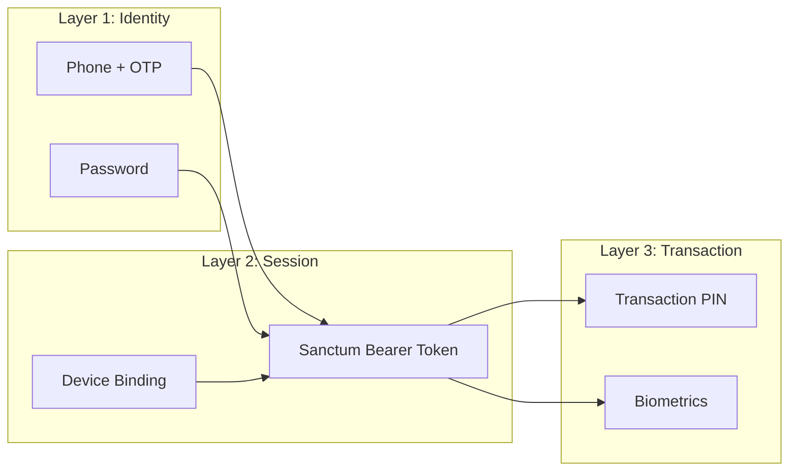

# EpayNepal — Security Architecture

## 1. Authentication Layers



## 2. Password & PIN Security

| Item | Algorithm | Storage | Notes |
|------|----------|---------|-------|
| Login password | bcrypt (cost 12) | `users.password_hash` | Never logged, never in API response |
| Transaction PIN | bcrypt (cost 12) | `users.pin_hash` | Separate from password, 4-6 digits |
| OTP codes | bcrypt | `otp_codes.code_hash` | Expire after 5 minutes, max 3 attempts |
| API tokens | SHA-256 | `personal_access_tokens.token` | Sanctum default hashing |

**Rules:**
- Passwords require: minimum 8 characters, 1 uppercase, 1 number
- PIN: exactly 4-6 digits, cannot be sequential (1234) or repeated (1111)
- Never log passwords, PINs, or tokens in any log file

## 3. Rate Limiting

| Endpoint | Limit | Window | Action on Exceed |
|----------|-------|--------|-----------------|
| POST /auth/login | 5 | 1 minute | 429 + 60s lockout |
| POST /auth/register | 3 | 5 minutes | 429 |
| POST /auth/verify-otp | 5 | 5 minutes | 429 + invalidate OTP |
| POST /auth/resend-otp | 3 | 5 minutes | 429 |
| POST /wallet/send-money | 10 | 1 minute | 429 |
| POST /wallet/top-up | 10 | 1 minute | 429 |
| POST /qr/pay | 10 | 1 minute | 429 |
| General API | 60 | 1 minute | 429 |

## 4. Transaction Security

### Row-Level Locking
Every money operation uses:
```php
DB::transaction(function () {
    $senderWallet = Wallet::where('user_id', $senderId)->lockForUpdate()->first();
    $receiverWallet = Wallet::where('user_id', $receiverId)->lockForUpdate()->first();
    // ... debit, credit, log
});
```

### Double-Spend Prevention
- `lockForUpdate()` prevents concurrent reads of the same wallet row
- `reference_id` has UNIQUE constraint to prevent duplicate transactions
- Idempotency key in request header for retry safety

### Audit Trail
Every financial operation creates a `transaction_logs` entry with:
- `balance_before` and `balance_after`
- Immutable (no UPDATE/DELETE on this table)
- Admin balance adjustments also logged in `audit_logs`

## 5. Input Validation

### Client-Side (Flutter/React)
- Field-level validation (format, length, required)
- Sanitize display text to prevent XSS
- **Never trust client-side validation as the only check**

### Server-Side (Laravel)
- Form Request classes for every endpoint
- Type checking, range validation, enum validation
- SQL injection prevention via Eloquent parameterized queries
- XSS prevention via response encoding

## 6. File Upload Security (KYC Documents)

| Check | Rule |
|-------|------|
| File type | Only `image/jpeg`, `image/png`, `application/pdf` |
| File size | Max 5MB per file |
| Storage | Cloudflare R2 (outside web root) |
| Access | Signed URLs with 1-hour expiry |
| Path exposure | Never expose raw storage paths in API responses |
| Virus scan | Future enhancement (log in improvements.md) |

## 7. CORS Configuration

```php
'allowed_origins' => [
    'http://localhost:5173',      // Admin dev
    'https://admin.epaynepal.com' // Admin production
],
'allowed_methods' => ['GET', 'POST', 'PUT', 'DELETE', 'OPTIONS'],
'allowed_headers' => ['Content-Type', 'Authorization', 'X-Idempotency-Key'],
'max_age' => 86400,
```

## 8. HTTPS

- All production traffic over HTTPS (TLS 1.2+)
- HSTS header enabled
- SSL certificates via Let's Encrypt (auto-renewal)
- API rejects HTTP requests in production

## 9. Session Management

- Sanctum tokens expire after 30 days (configurable)
- Users can view/revoke active sessions
- Admin can force-logout any user
- Device binding: new device requires OTP verification

## 10. Audit Logging

All admin actions are logged in `audit_logs`:
- Who (admin_user_id)
- What (action, entity_type, entity_id)
- Before/after values (old_values, new_values as JSON)
- When (created_at)
- Where (ip_address)
