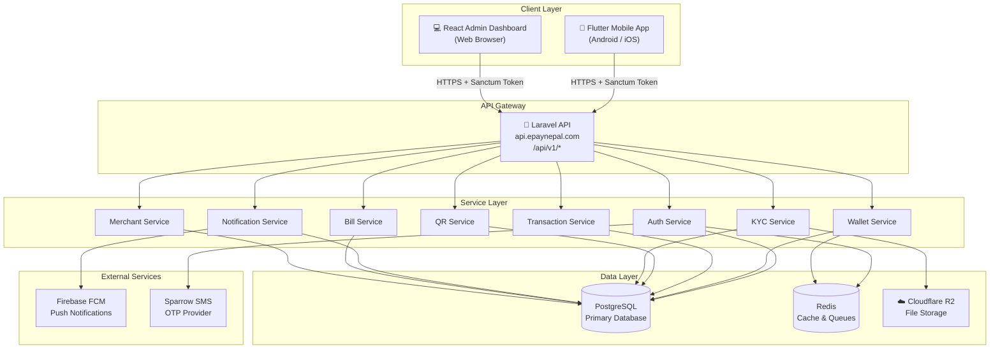
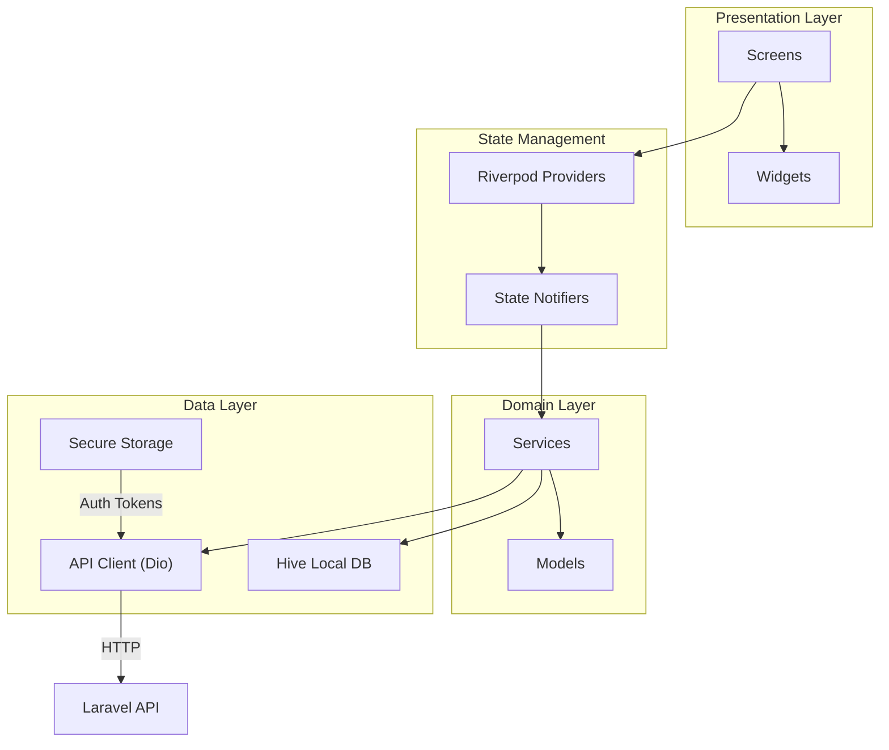
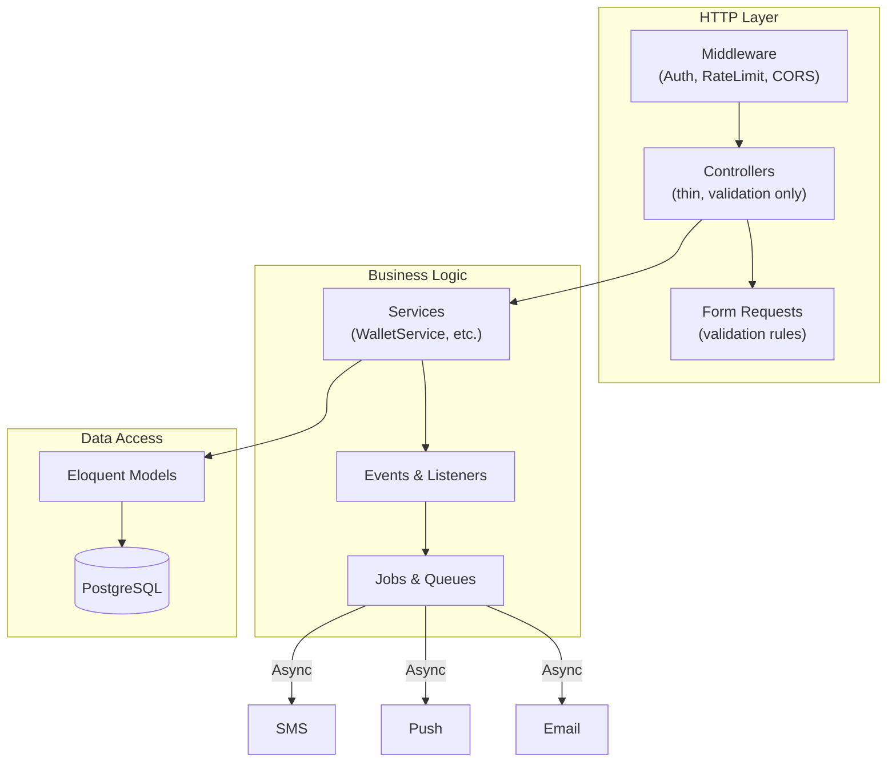
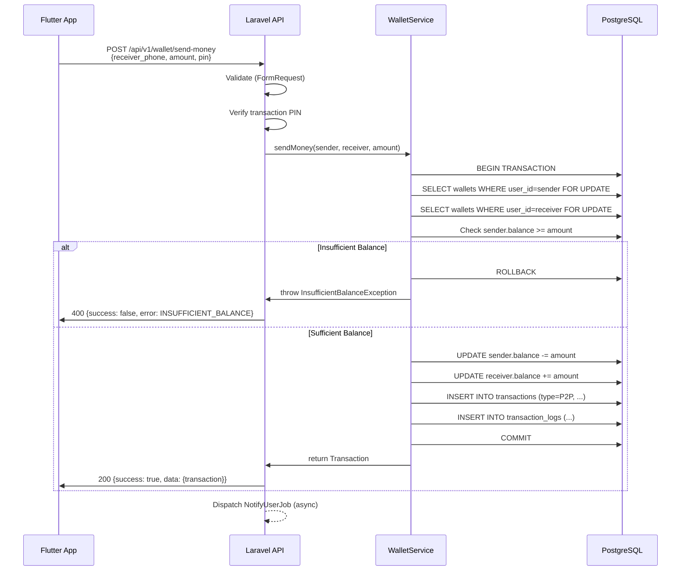
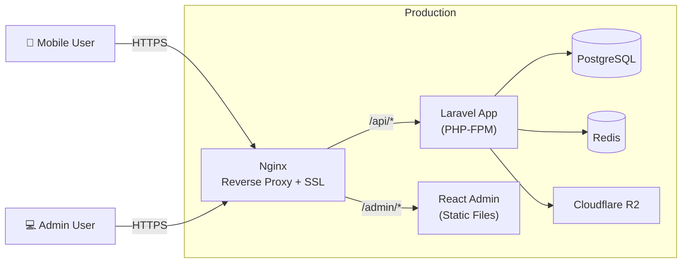

# EpayNepal — System Design

## 1. High-Level Architecture

## 2. Low-Level Component Architecture

### Mobile App (Flutter)

### Backend (Laravel)

## 3. Data Flow: Send Money (P2P)

## 4. Deployment Architecture

