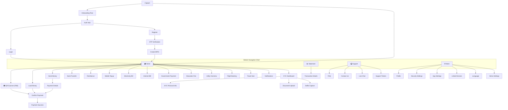

# EpayNepal — UI Flow (Screen Navigation Map)

## Main Navigation Structure

## Screen Categories

### Top-Level Routes (outside shell)
| Route | Screen | Purpose |
|-------|--------|---------|
| `/` | Splash | Auto-auth check, redirect |
| `/onboarding` | Onboarding Flow | First-time user intro |
| `/auth` | Auth Hub | Login/Register choice |
| `/login` | Login | Phone + password |
| `/register` | Register | Phone + name + password |
| `/otp` | OTP Verification | 6-digit code entry |
| `/create_mpin` | Create MPIN | Transaction PIN setup |
| `/scan_qr` | QR Scanner | Camera + scan |

### Shell Routes (bottom navigation)
| Route | Tab | Screen |
|-------|-----|--------|
| `/home` | Home | Dashboard |
| `/statement` | Statement | Transaction history |
| `/support` | Support | Help center |
| `/more` | More | Settings & profile |

### Feature Routes (pushed from shell)
| Route | Screen |
|-------|--------|
| `/load_money` | Load wallet |
| `/bank_accounts` | Linked banks |
| `/bank_transfer` | Transfer to bank |
| `/remittance` | Remittance |
| `/payment_details` | Payment form |
| `/confirm_payment` | Confirm & PIN |
| `/payment_success` | Success state |
| `/topup` | Mobile recharge |
| `/electricity` | Electricity bill |
| `/internet` | Internet bill |
| `/govt_payment` | Government payment |
| `/education_fee` | Education fee |
| `/utility` | Utility overview |
| `/flight_booking` | Flight booking |
| `/travel_hub` | Travel overview |
| `/kyc_dashboard` | KYC status |
| `/kyc_personal_info` | KYC form |
| `/transaction_details` | Receipt view |
| `/test_demo_settings` | Demo controls |
