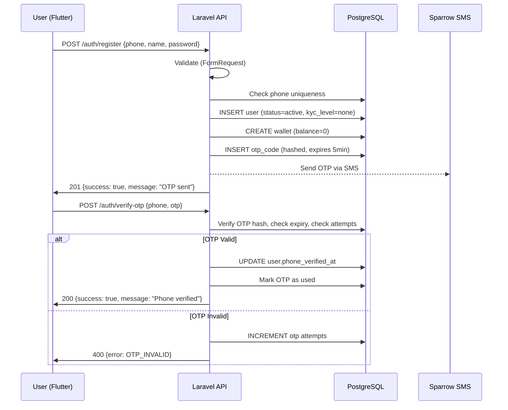
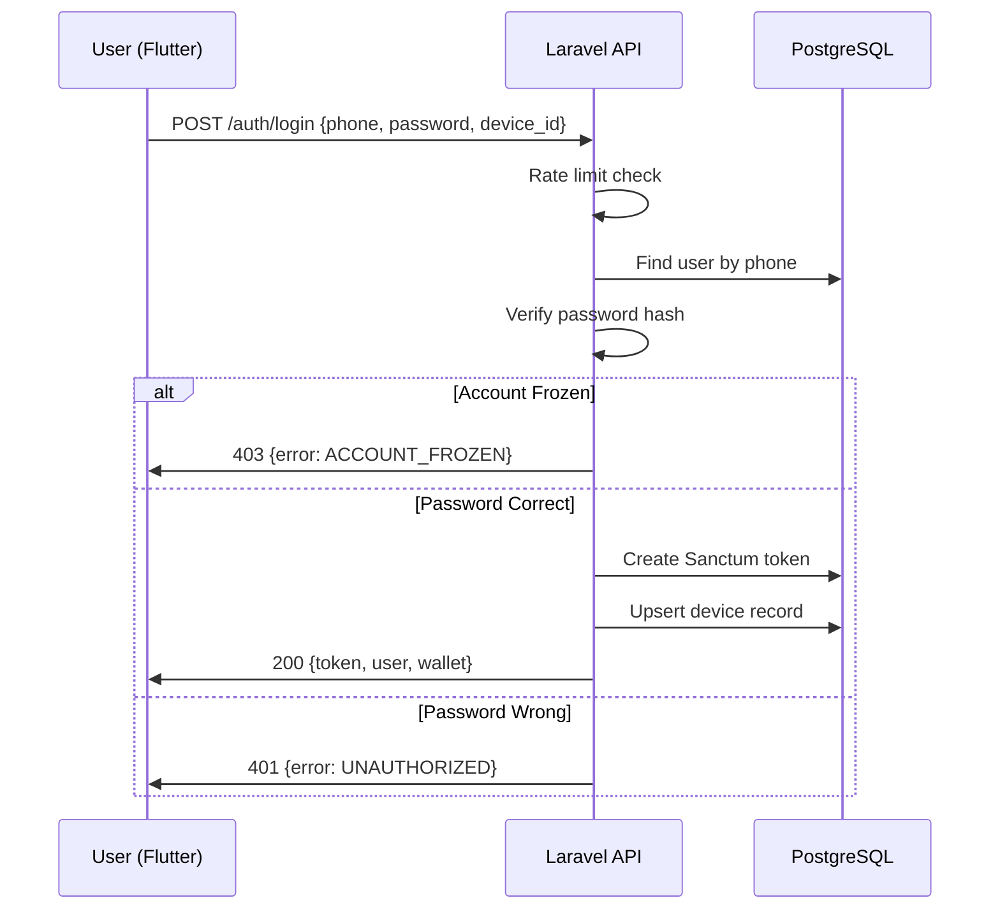
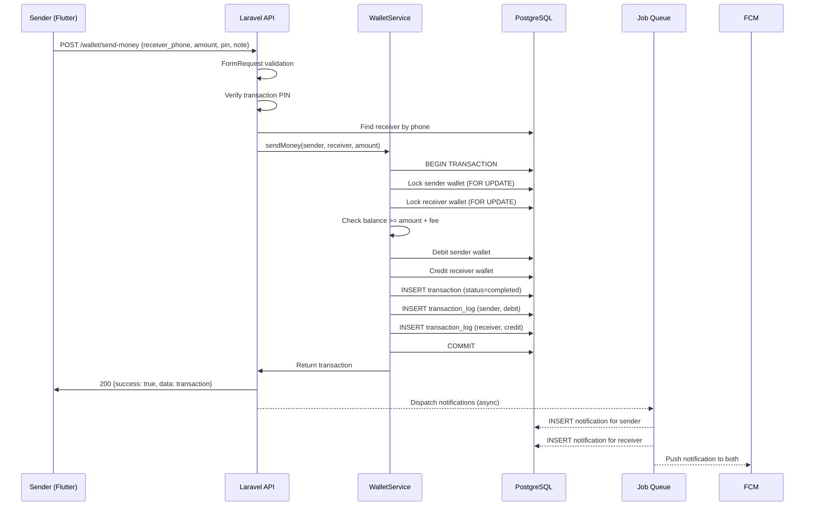
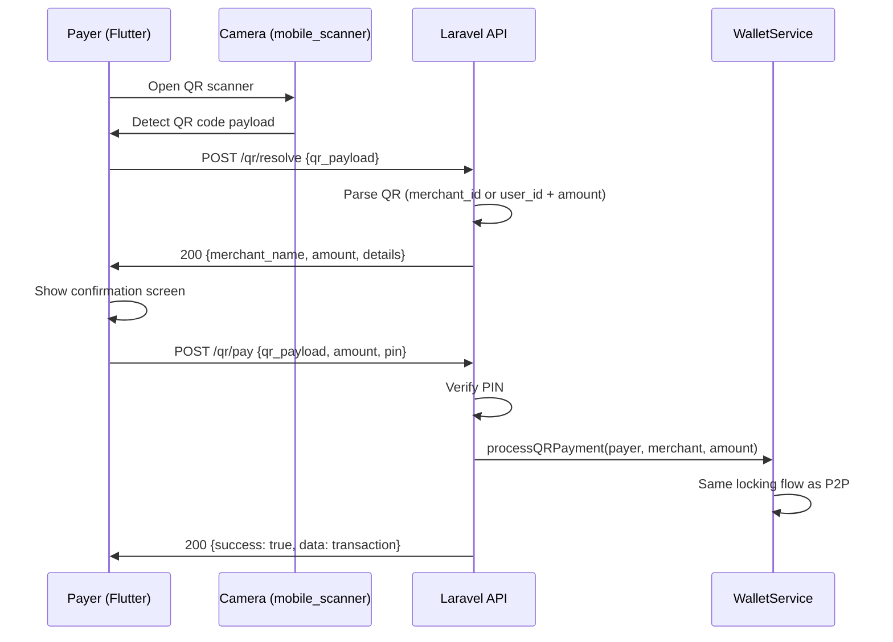
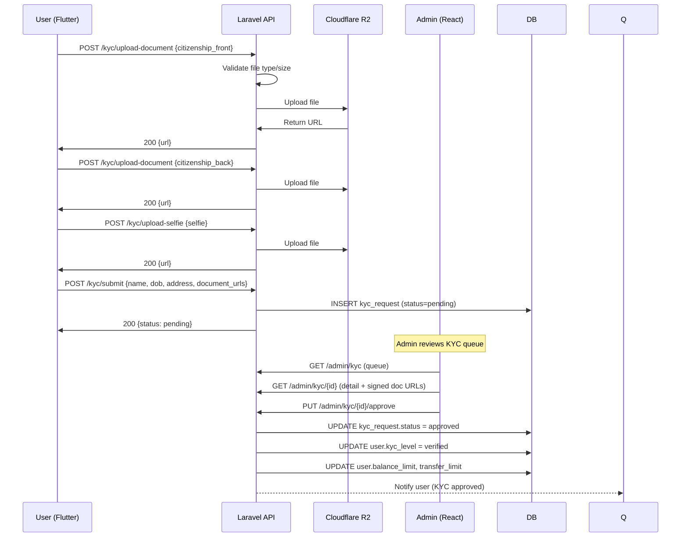
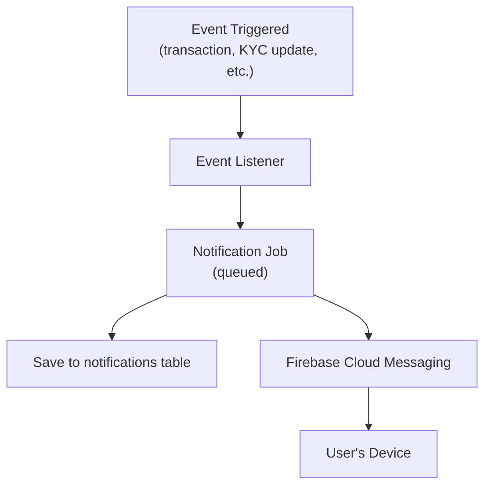
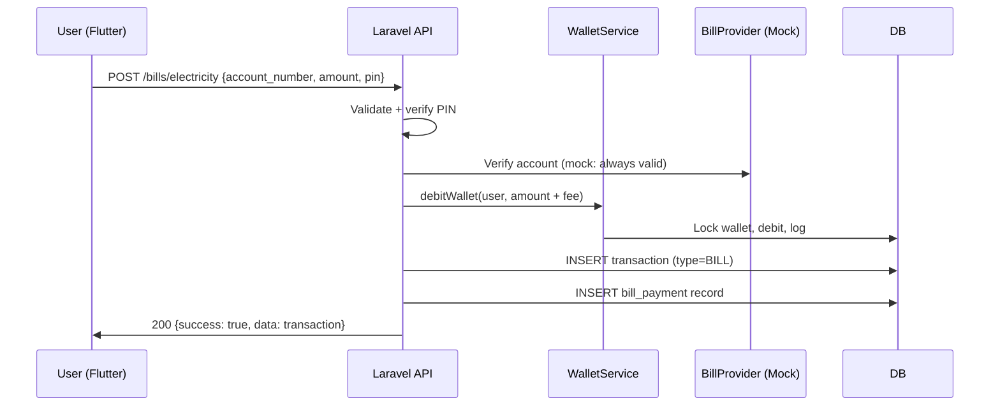

# EpayNepal — Workflow Diagrams

## 1. User Registration & Verification

## 2. Login Flow

## 3. Send Money (P2P Transfer)

## 4. QR Payment Flow

## 5. KYC Submission & Review

## 6. Notification Delivery

## 7. Bill Payment Flow

